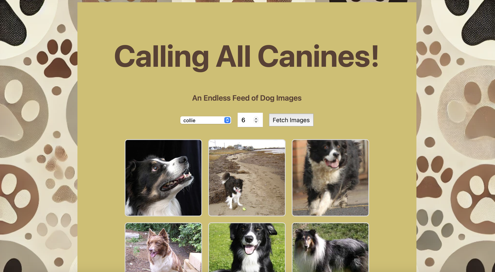

# Dog Image Gallery

This project is a simple Dog Image Gallery built with JavaScript. It fetches random dog images from an API and displays them in a gallery format.



## Features

- Fetches random dog images from the Dog API.
- Displays images in a responsive gallery layout.
- Allows users to load more images.

## Installation

1. Clone the repository:
    ```sh
    git clone https://github.com/yourusername/DogImageGallery.git
    ```
2. Navigate to the project directory:
    ```sh
    cd DogImageGallery
    ```
3. Open `index.html` in your browser to view the gallery.

## Usage

- Click the "Load More" button to fetch and display more dog images.

## Technologies Used

- HTML
- CSS
- JavaScript
- Dog API (https://thedogapi.com/)

## Contributing

Contributions are welcome! Please fork the repository and submit a pull request.

## License

This project is licensed under the MIT License. See the [LICENSE](LICENSE) file for details.

## Acknowledgements

- [The Dog API](https://thedogapi.com/) for providing the dog images.
